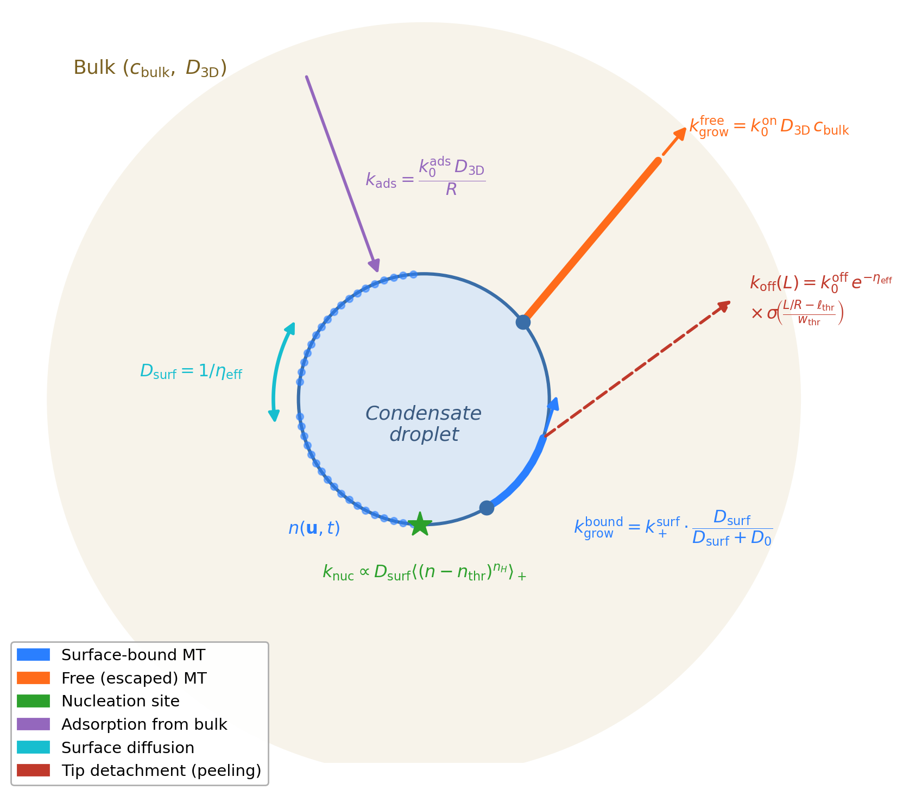

# mttoy

Minimal stochastic model of microtubule nucleation and growth at condensate droplet surfaces. The code was used to produce results reported in the paper: 

## Citation

If you use this code, please cite the associated manuscript (in preparation).

> S. Srinivasan, A Sing, DA Potoyan, PR Banerjee "Synthetic Biomolecular Condensates as Tunable Microtubule Assembly Hubs"

### Model details 

The model implements a Gillespie/PDMP simulation capturing:

- Surface tubulin adsorption and 2D diffusion
- Interface-viscosity-controlled nucleation and growth (diffusion-saturation form)
- Tip peeling with Kramers barrier dependent on viscosity η

The scheamtic shows summary of reactions.



## Install

```bash
pip install -e .
```

## Usage

```python
from mttoy import Params, run_simulation

p = Params(name="RGRGG", eta_eff=10.0, c_dilute=15.0)
out = run_simulation(p, T_end=2000, seed=42)
print(out["metrics"].tail())
```

## Repository layout

```text
mttoy/              # simulation package (core, analysis, viz)
docs/               # methods SI and results text (Markdown/LaTeX)
figures/            # generated figure outputs (gitignored)
production_runs.ipynb  # main analysis notebook
```